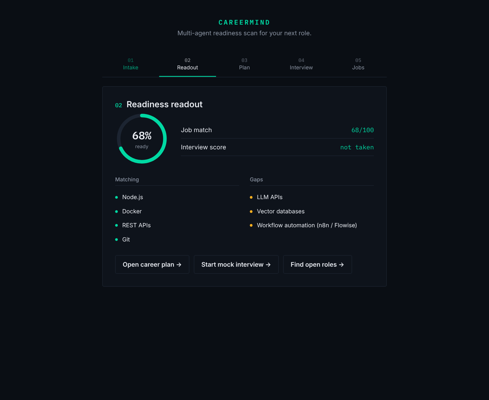
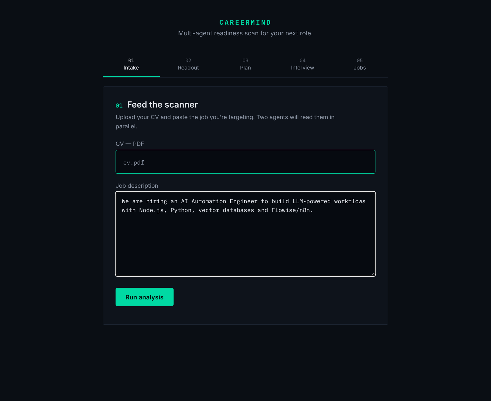
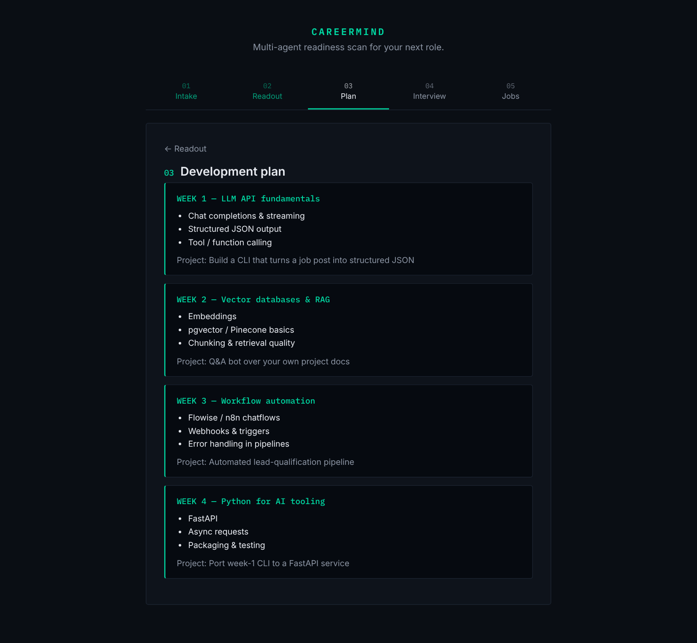
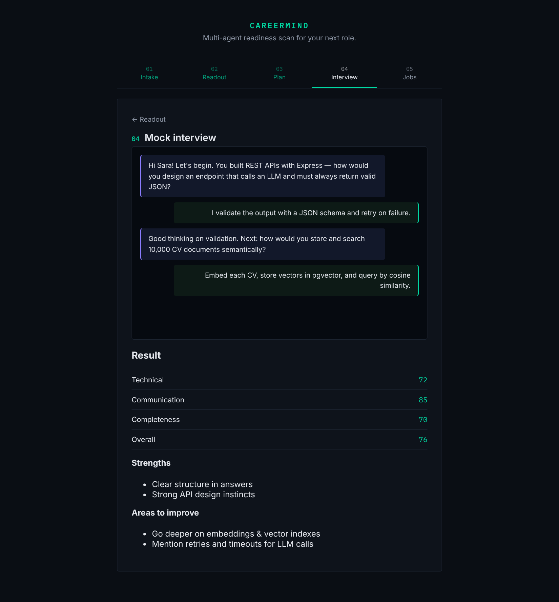
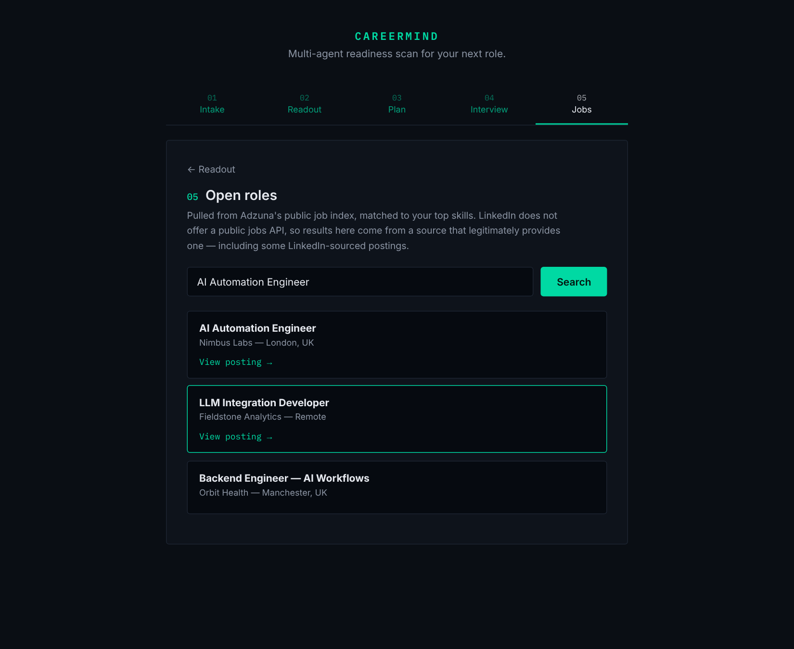
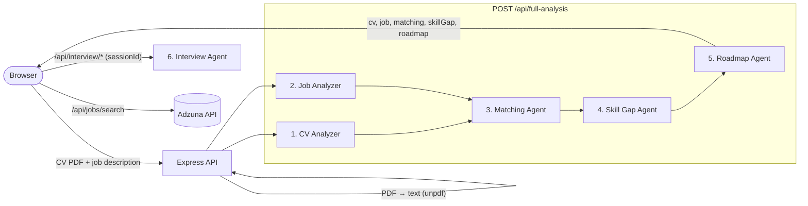

<div align="center">

# CareerMind AI

**A multi-agent readiness scan for your next role.**

Upload your CV, paste the job you want, and six specialized AI agents tell you how
well you match, what you're missing, how to close the gap, and whether you're ready
for the interview.




</div>

---

## Contents

- [Why CareerMind](#why-careermind)
- [Screenshots](#screenshots)
- [The 6 agents](#the-6-agents)
- [Architecture](#architecture)
- [Getting started](#getting-started)
- [Configuration](#configuration)
- [Deployment](#deployment)
- [API reference](#api-reference)
- [Error handling](#error-handling)
- [Troubleshooting](#troubleshooting)
- [Roadmap](#roadmap)

## Why CareerMind

Most "CV vs. job" tools stop at a match percentage. CareerMind goes further:

| Feature | What you get |
| --- | --- |
| **Job match score** | Your CV broken down against the job into matching, partial and missing skills. |
| **Skill-gap reasoning** | For every missing skill: *why* it matters for this role, what to study, and a project to build. |
| **Week-by-week roadmap** | The gaps turned into a concrete learning plan. |
| **AI mock interview** | Questions grounded in your real CV and the job's requirements, scored on Technical, Communication, Completeness and Overall. |
| **Open roles** *(optional)* | Live job listings matched to your profile via the Adzuna API. |

## Screenshots

> Screenshots were captured with sample data.

| Intake | Readiness readout |
| --- | --- |
|  |  |
| **Development plan** | **Mock interview** |
|  |  |
| **Interview result** | **Open roles** |
|  |  |

## The 6 agents

Instead of asking one general-purpose model to do everything, CareerMind splits the
work across **six agents with one job each**. Each agent has its own system prompt
(in [`services/prompts.js`](career-mind-app/backend/services/prompts.js)) and runs on an
LLM through [OpenRouter](https://openrouter.ai). You only need **one API key**.

Any agent can also run on your own AiMicromind / Flowise chatflow: set its URL variable
(last column) and that agent uses the chatflow instead of the built-in prompt.

| # | Agent | Input | Output | Optional chatflow override |
|---|-------|-------|--------|--------------|
| 1 | **CV Analyzer** | Raw text extracted from the CV PDF | Structured profile: name, title, experience, skills… | `CV_ANALYZER_URL` |
| 2 | **Job Analyzer** | The pasted job description | Structured job: `job_title`, required skills, seniority… | `JOB_ANALYZER_URL` |
| 3 | **Matching Agent** | Output of agents 1 + 2 | `job_match_score` (0–100), `matching_skills`, `partial_match_skills`, `missing_skills` | `MATCHING_URL` |
| 4 | **Skill Gap Agent** | Missing + partial skills and the job data | For each gap: why it matters, what to study, a project to build | `SKILLGAP_URL` |
| 5 | **Roadmap Agent** | The skill-gap analysis | `weeks[]` — each with `week_number`, `focus`, `topics[]`, `project` | `ROADMAP_URL` |
| 6 | **Interview Agent** | CV + job data, then the candidate's answers | Interview questions one at a time, then a final JSON evaluation | `INTERVIEW_URL` |

### 1. CV Analyzer
Turns unstructured CV text into clean JSON. Everything downstream depends on it, so
its System Message should be strict about returning **JSON only**.

### 2. Job Analyzer
Does the same for the job description: the title, the must-have and nice-to-have
skills, and the level of the role. It runs **in parallel** with the CV Analyzer.

### 3. Matching Agent
Compares the two profiles skill by skill and produces the job match score shown on
the readiness gauge, plus the *Matching* and *Gaps* lists.

### 4. Skill Gap Agent
Reasons about each missing or partial skill **in the context of this job** — not just
"learn Docker", but why the role needs it and a concrete project that proves it.

### 5. Roadmap Agent
Turns the gap analysis into a week-by-week development plan with topics and a
hands-on project per week.

### 6. Interview Agent
Runs a conversational mock interview: five questions, one at a time, mixing the
job's required skills with the candidate's real projects, with short feedback after
each answer. The server is stateless (it works on serverless platforms), so the browser
sends the conversation so far with each answer. With a chatflow override, the flow's
Buffer Memory keeps the conversation by `sessionId` instead. At the end, the agent
replies with a JSON evaluation:

```json
{
  "technical_score": 72,
  "communication_score": 85,
  "completeness_score": 70,
  "overall_score": 76,
  "strengths": ["..."],
  "areas_to_improve": ["..."]
}
```

The backend detects this reply automatically and the UI shows the scored result. The
overall readiness becomes the average of the job match score and the interview score.

## Architecture



```
career-mind-app/backend/
├── server.js               # Express app: routes, health check, JSON error handler
├── routes/
│   ├── analyze.js          # PDF parsing + agents 1–5
│   ├── interview.js        # Agent 6 (start / message)
│   └── jobs.js             # Adzuna job search
├── services/
│   ├── agents.js           # Agent registry, OpenRouter / chatflow calls, errors, JSON parsing
│   └── prompts.js          # System prompts of the 6 agents
└── public/                 # Frontend (vanilla HTML / CSS / JS)
```

**Tech stack:** Node.js + Express · OpenRouter for LLM access ·
AiMicromind (Flowise) chatflows as an optional per-agent override · `unpdf` for PDF text extraction · vanilla HTML/CSS/JS ·
Adzuna API for job search.

## Getting started

### Prerequisites

- **Node.js 20+** (24.x recommended; production pins 24.x)
- A free [OpenRouter API key](https://openrouter.ai/keys)
- *(Optional)* a free [Adzuna](https://developer.adzuna.com/) API key for job search

### 1. Install

```bash
git clone https://github.com/bodamansour/careermind-ai.git
cd careermind-ai/career-mind-app/backend
npm install
```

### 2. Configure

```bash
cp .env.example .env
```

Open `.env` and set `OPENROUTER_API_KEY`. That's all you need. See
[Configuration](#configuration) for the optional settings.

### 3. Run

```bash
npm start
```

Open **http://localhost:3000**. To check your setup, open
**http://localhost:3000/api/health**. It lists any agent URL that is still missing.
The server also prints a warning on startup.

## Configuration

| Variable | Required | Description |
| --- | :---: | --- |
| `OPENROUTER_API_KEY` | ✅ | Your [OpenRouter key](https://openrouter.ai/keys). Powers all 6 agents |
| `OPENROUTER_MODEL` | – | Any [model id](https://openrouter.ai/models). Default `openrouter/free`, which picks a free model (rate limited). For faster, more consistent results, use a paid model such as `openai/gpt-4o-mini` |
| `CV_ANALYZER_URL` … `INTERVIEW_URL` | – | Run that agent on your own AiMicromind / Flowise chatflow instead of the built-in prompt |
| `AIMICROMIND_API_KEY` | – | Only if your chatflows use *API Key* authorization |
| `ADZUNA_APP_ID` / `ADZUNA_APP_KEY` | – | Turns on the *Open roles* step |
| `ADZUNA_COUNTRY` | – | Two-letter job market code (`gb`, `us`, `in`, `de`, …). Default `gb` |
| `FLOW_TIMEOUT_MS` | – | Max wait per agent call in ms. Default `90000` |
| `PORT` | – | Local port. Default `3000` (Render sets this for you) |

> **Job search:** LinkedIn has no public API for personalized job recommendations,
> so CareerMind uses Adzuna, which aggregates listings from many sources. Egypt is not
> currently an Adzuna market, so pick the closest one. Without Adzuna keys, the app
> still works fully and the Jobs step shows a clear "not configured" message.

## Deployment

The backend serves both the API and the frontend, so you deploy **one service**.

### Option A — Vercel

`server.js` exports the Express app, which Vercel's Express support detects with no
extra config. Files in `public/` are served from Vercel's CDN.

1. Import the repo at [vercel.com/new](https://vercel.com/new).
2. Set **Root Directory** to `career-mind-app/backend`. Leave the framework preset
   as detected (Express / Other), with no build command.
3. Under **Environment Variables**, add `OPENROUTER_API_KEY` (and optionally the
   other variables from [Configuration](#configuration)).
4. Deploy, then open `https://<your-app>.vercel.app/api/health` to check the config.

> **Limits on Vercel:** request bodies are capped at 4.5 MB (CV uploads are capped at
> 4 MB for this reason). The full analysis makes four rounds of agent calls in a row,
> so it can take a while. If you see timeouts, raise the function's max duration in
> *Project Settings → Functions* or use Render.

### Option B — Render

The repo includes a [`render.yaml`](render.yaml) Blueprint.

1. In Render, click **New + → Blueprint** and pick this repo.
2. Paste your `OPENROUTER_API_KEY` when Render asks for it (Adzuna keys are optional).
3. Click **Apply**. Render runs `npm ci`, starts the app with `npm start`, and
   health-checks `/api/health`.

<details>
<summary>Manual setup (without the Blueprint)</summary>

- **New + → Web Service**, connect the repo
- **Root Directory:** `career-mind-app/backend`
- **Build Command:** `npm ci` · **Start Command:** `npm start`
- **Health Check Path:** `/api/health`
- Add the environment variables from [Configuration](#configuration)

</details>

> Render's free plan sleeps after inactivity, so the first request after a while can
> take ~30–60 s.

## API reference

All endpoints return JSON. Errors always have the shape `{ "error": "<message>" }`.

| Method | Path | Body | Response |
| --- | --- | --- | --- |
| `GET` | `/api/health` | – | `{ status, agents: { <name>: "llm" \| "flow" \| "not configured" }, jobSearch }` |
| `POST` | `/api/full-analysis` | multipart: `cvFile` (PDF ≤ 4 MB), `jdText` | `{ cv, job, matching, skillGap, roadmap }` |
| `POST` | `/api/interview/start` | `{ cv, job }` | `{ sessionId, message, isFinal: false }` |
| `POST` | `/api/interview/message` | `{ sessionId, message, cv, job, history[] }` | `{ message, isFinal, evaluation }` |
| `GET` | `/api/jobs/search?q=<role>` | – | `{ jobs: [{ title, company, location, url }] }` |

## Error handling

Every failure returns a clear, specific message, and the UI shows it as a toast.

| Situation | Status | Example message |
| --- | :---: | --- |
| Missing file / job description, input too long | 400 | `No CV file uploaded.` |
| File is not a PDF, or is corrupted / password-protected | 400 | `The uploaded file is not a PDF…` |
| Scanned / image-only PDF | 400 | `Could not extract any text from the PDF…` |
| CV larger than 4 MB | 413 | `CV file is too large (max 4 MB).` |
| No API key set | 503 | `Matching Agent is not configured. Set OPENROUTER_API_KEY…` |
| Wrong API key / out of credits | 502 | `CV Analyzer rejected the request (HTTP 401). Check OPENROUTER_API_KEY.` |
| Rate limited (free models) | 503 | `Job Analyzer is rate limited. Wait a minute and try again.` |
| Chatflow override not found | 502 | `Roadmap Agent was not found (HTTP 404). Check ROADMAP_URL.` |
| Agent returned non-JSON | 502 | `Skill Gap Agent returned an unexpected format…` |
| Agent too slow | 504 | `Interview Agent took too long to respond…` |
| Job search not configured | 503 | `Job search is not configured yet…` |

The server logs the details (HTTP status, start of the raw reply) for debugging. It
never sends stack traces to the client. On the frontend, network failures and non-JSON
responses (for example, a platform timeout page) also become readable messages, and
all model output is rendered as plain text, never as HTML.

## Troubleshooting

- **`/api/health` shows `degraded`** — `OPENROUTER_API_KEY` is not set. The `agents`
  field shows how each agent is configured.
- **An agent fails with HTTP 401 / "User not found"** — the OpenRouter key is invalid
  or was deleted. If that agent uses a chatflow override, the key stored *inside* the
  chatflow is the one to fix, or remove the override URL to use the built-in agent.
- **"rate limited"** — free models allow only a limited number of requests per minute
  and per day. Wait, add a few credits on OpenRouter, or set `OPENROUTER_MODEL` to a
  paid model.
- **"… returned an unexpected format"** — the model replied without valid JSON twice
  in a row (the server retries once). Small free models do this sometimes. Try again,
  or set `OPENROUTER_MODEL` to a stronger model.
- **Chatflow override rejected (HTTP 401/403)** — the chatflow uses API-key auth. Set
  `AIMICROMIND_API_KEY`.
- **Interview never shows a result** — the final evaluation must be JSON with a
  numeric (or numeric-string) `overall_score`.

## Roadmap

- [ ] Accounts and saved scans (PostgreSQL)
- [ ] OCR for scanned CVs
- [ ] Streaming agent progress to the loading screen
- [ ] Exportable PDF report of the readiness scan
